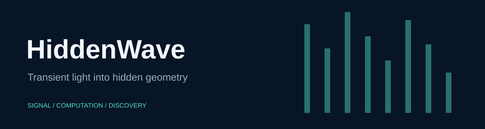

# HiddenWave

Confocal non-line-of-sight volume reconstruction with backprojection, light-cone inversion, frequency-wavenumber migration, and phasor fields.

> **Development history:** Developed locally before publication. These repositories were uploaded together, so their GitHub publication dates do not indicate when development began.

## Quick start

Open MATLAB in this repository, then use the branded entry point:

```matlab
volume = hidden_wave(meas, [], wall_size, 2, 512, 32e-12);
```

The entry point preserves the existing function's arguments, errors, and numerical output. Existing script and function names remain available for compatibility. No sensor starts when you open this repository.

## Inputs and workflows

Measurements are spatial × spatial × time. Supply calibrated transient measurements and matching wall size, crop length, and bin resolution. External research datasets are not bundled. Phasor fields need Signal Processing Toolbox (gausswin).

## Verification

Run `run('tests/smoke_test.m')` from the repository root. See [verification details](docs/VERIFICATION.md) for the tested scope and unavailable checks. Computational source and bundled scientific assets are retained byte-for-byte; the added facade and documentation provide the new presentation.

## License

The numerical source retains its institutional academic/noncommercial terms in LICENSE. MIT in LICENSE-branding covers the new documentation, artwork, wrapper, and checks only.
